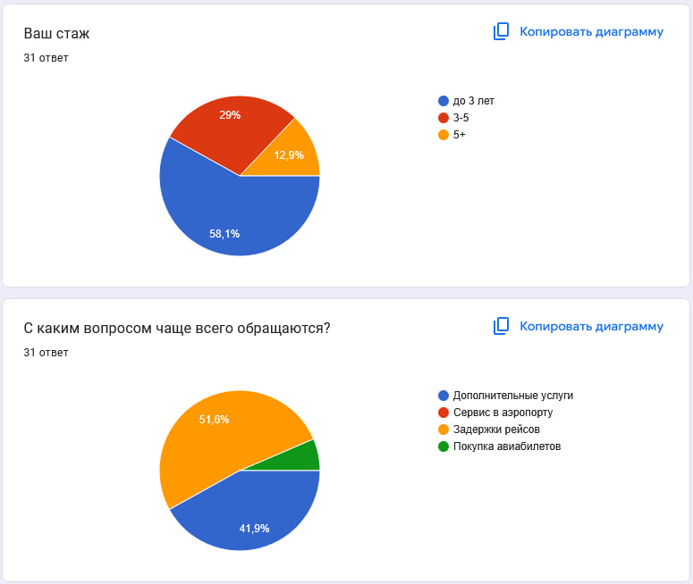
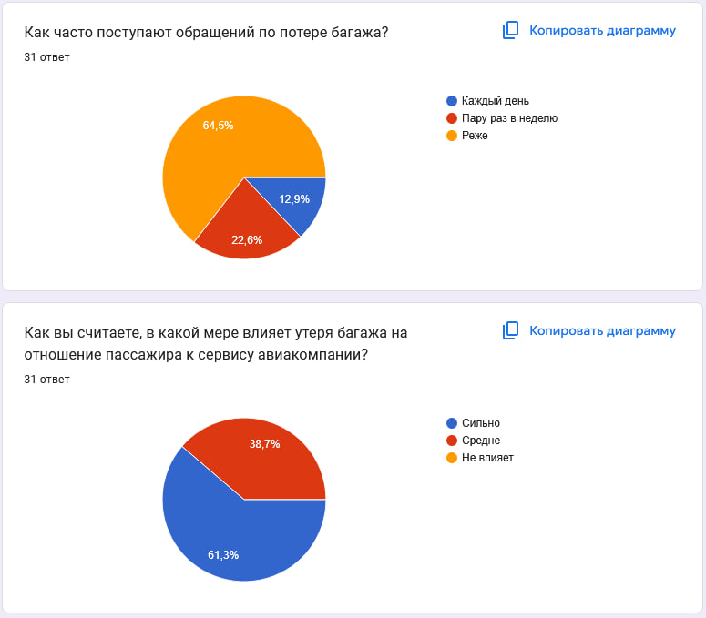
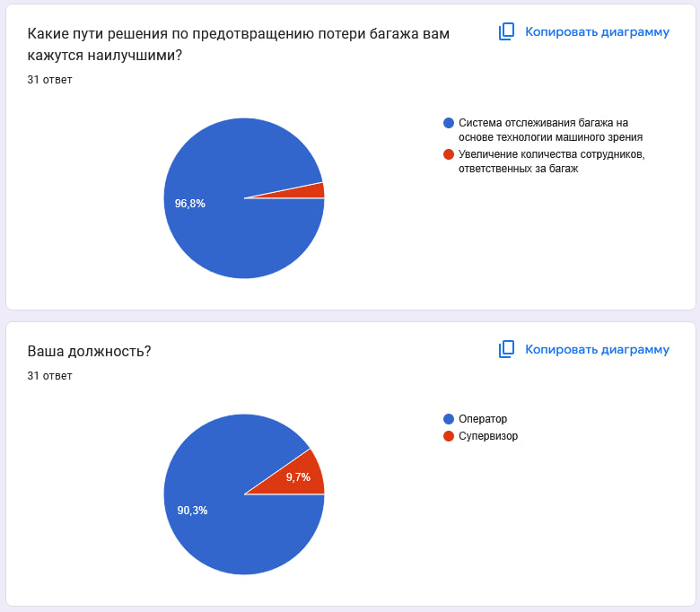
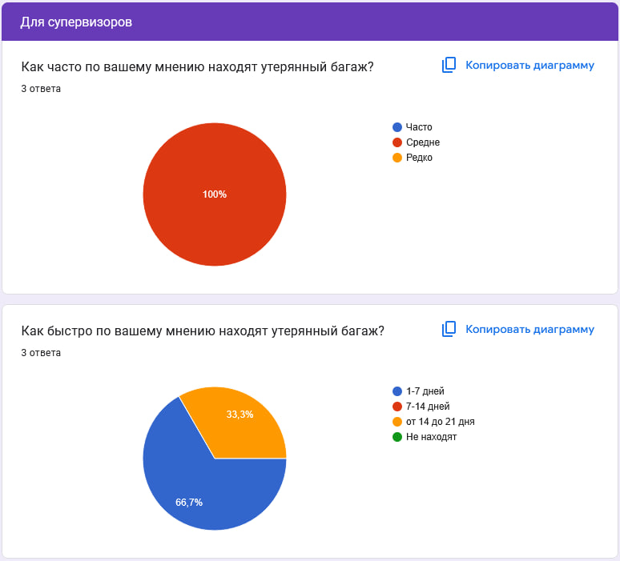
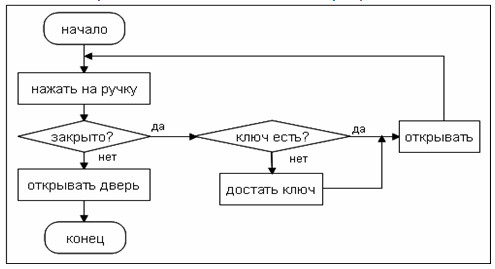

# Аналитические артефакты и описание проекта
Перед тем, как преступать к реализации идеи мы провели ряд исследований.

Во-первых, нам удалось провести опрос среди сотрудников колл-центров компаний Smartavia и Red Wings.

опрос - https://docs.google.com/forms/d/e/1FAIpQLSf1MUyG6UO22YwwyrLtXGCx_yBeEzG7yfqw4iiJ_Us4QyfWog/viewform?usp=dialog

В опросе принял участие 31 человек. Ниже приложены результаты анкетирования.
>

>   
>

>

>   
>

>

>   
>

>

>   
>

Исходя из полученных ответов можно сделать следующие выводы:

-Примерно 35% операторов хоть раз в неделю поступает звонок о пропаже багажа
-Большинтсво опрошенных считают, что потеря багажа негативно сказывается на облике авиакомпании
-Сотрудникам вариант использования алгоритмов машиного обучения для предотвращения потери багажа кажется оптимальным
**Порядок описания аналитических артефактов:**
1) Основные объекты продукта

> Подберите и приложите диаграмму(-ы), подходящую(-ие) под ваше решение.

> Вам помогут вопросы: Какие основные объекты вашего решения? Какие существуют атрибуты? Какие существуют связи? Какие операции осуществляются?

2) Ролевая модель

>Вам помогут вопросы:
>Кто ваши пользователи?
>Какие функции они выполняют в системе?
>Как продукт определяет пользователя и есть ли у пользователя ограничения?
>Какие образом назначаются роли?

3) Пользовательские/Функциональные/Нефункциональные требования

>Определите требования для реализации решения, распределите требования на виды. Пользовательские требования могут быть представлены в виде диаграмм.

   
4) Прототипы интерфейса
>Опишите возможности вашего интерфейса. Какие существуют экранные формы? Как различные пользователи взаимодействуют с вашим интерфейсом?

>При наличии дизайнера в команде интерфейсы должны соответствовать [дизайну продуктов S7](https://www.s7.ru/ru/info/s7-airlines/brand/). Если дизайнера в команде нет, можно ограничиться схемами экранных форм.

5) Перспективы расширения системы

>Представьте, что вы не ограничены во времени разработки решения.

>Какие функции вы бы хотели добавить? Как мог бы развиваться ваш продукт в будущем?

**Инструменты для оформления решения**
> [!NOTE]
> Для вставки диаграмм/экранных форм используйте HTML-тэг "img". Диграмму нужно загрузить файлом в папку Desc и прописать внутри тэга её название. Формат изображений .png, .img/
> Пример вставки диаграммы
>

>   
>

> Для создания и оформления таблиц используйте документацию - https://docs.github.com/ru/get-started/writing-on-github/working-with-advanced-formatting/organizing-information-with-tables
>
> Пример таблицы https://github.com/s7-ai-wings/template-artifact/blob/main/Idea/README.md
>
>  Другие возможности оформления md-страниц в Github - https://docs.github.com/ru/get-started

